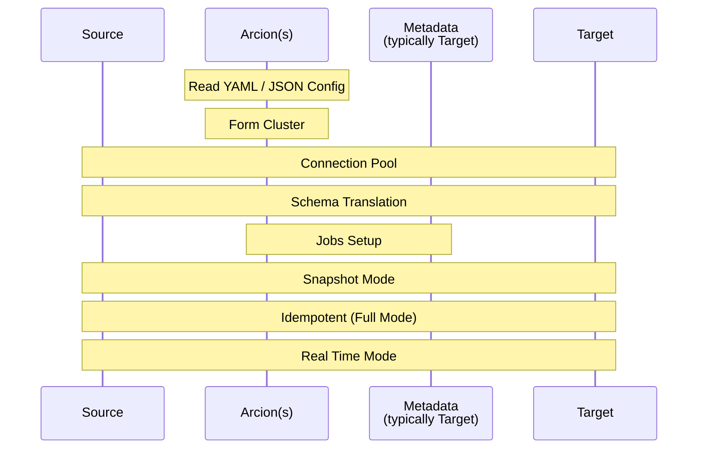
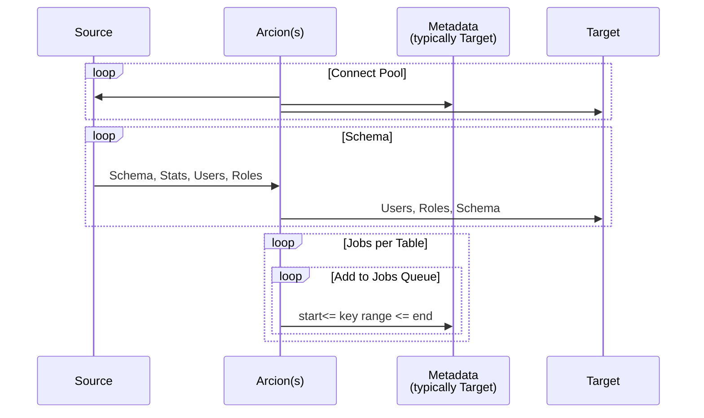
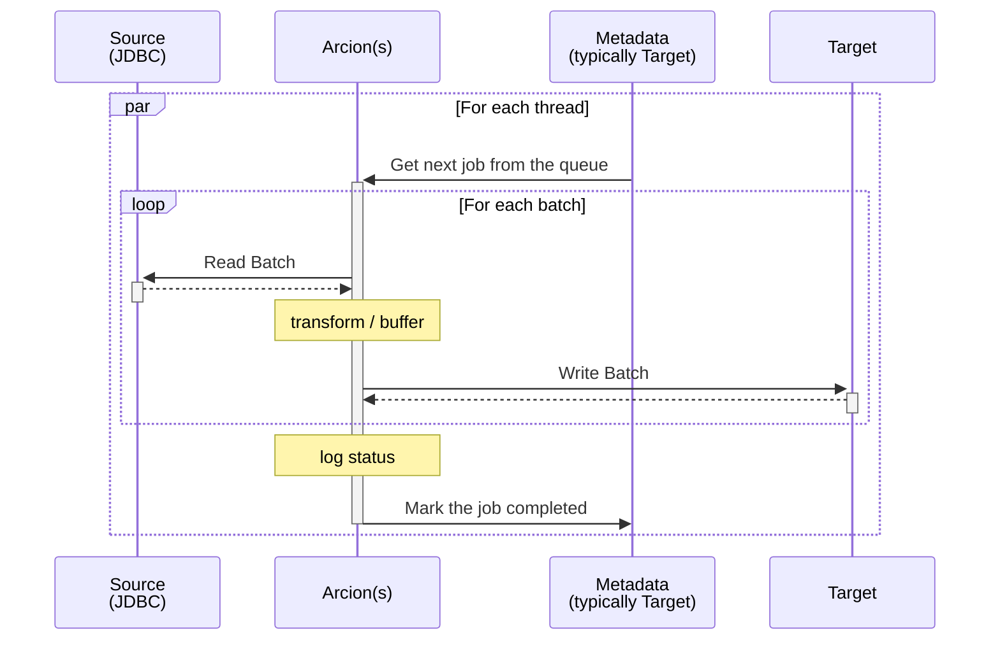
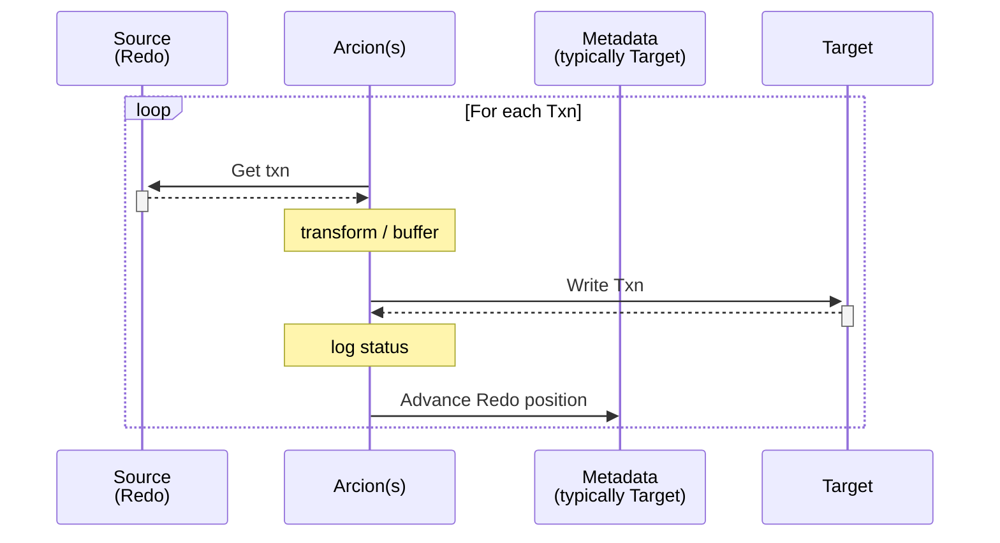

# High Level Sequence

```mermaid
sequenceDiagram
    participant Source as Source
    participant Arcion as Arcion(s)
    participant Metadata as Metadata <br> (typically Target)
    participant Target as Target

    Note over Arcion,Arcion: Read YAML / JSON Config
    Note over Arcion,Arcion: Form Cluster
    Note over Source,Target: Connection Pool
    Note over Source,Target: Schema Translation
    Note over Arcion,Metadata: Jobs Setup
    Note over Source,Target: Snapshot Mode
    Note over Source,Target: Idempotent (Full Mode)
    Note over Source,Target: Real Time Mode
```

# Connection, Schema, Jobs

```mermaid
sequenceDiagram
    participant Source as Source
    participant Arcion as Arcion(s)
    participant Metadata as Metadata <br> (typically Target)
    participant Target as Target

    Loop Connect Pool
    Arcion->>Source:  
    Arcion->>Metadata:   
    Arcion->>Target:   
    End   
    Loop Schema 
    Source->>Arcion: Schema, Stats, Users, Roles  
    Arcion->>Target: Users, Roles, Schema 
    End
    Loop Jobs per Table
    Loop Add to Jobs Queue 
    Arcion->>Metadata: start<= key range <= end 
    End
    End
```

# Snapshot

```mermaid
sequenceDiagram
    participant Source as Source <br> (JDBC)
    participant Arcion as Arcion(s)
    participant Metadata as Metadata <br> (typically Target)
    participant Target as Target
 
    Par For each thread
    Metadata->>+Arcion: Get next job from the queue
    Loop For each batch
    Arcion->>+Source: Read Batch
    Source-->>-Arcion:  

    Note over Arcion,Arcion: transform / buffer
    Arcion->>+Target: Write Batch
    Target-->>-Arcion:  
    End
    Note over Arcion,Arcion: log status
    Arcion->>-Metadata: Mark the job completed
    End
```

# Real Time

```mermaid
sequenceDiagram
    participant Source as Source <br>(Redo)
    participant Arcion as Arcion(s)
    participant Metadata as Metadata <br> (typically Target)
    participant Target as Target
 
    Loop For each Txn
    Arcion->>+Source: Get txn
    Source-->>-Arcion:  
    Note over Arcion,Arcion: transform / buffer
    Arcion->>+Target: Write Txn
    Target-->>-Arcion:  
    Note over Arcion,Arcion: log status
    Arcion->>Metadata: Advance Redo position
    End
```

    
    
